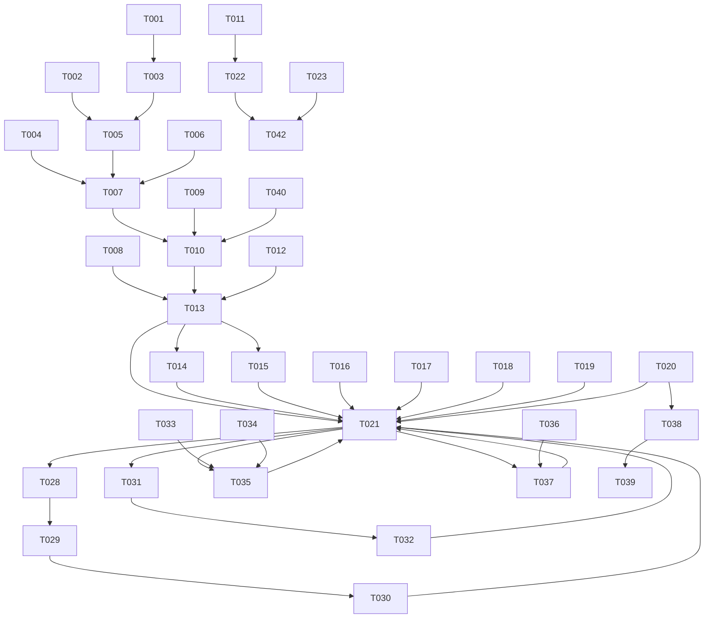

# Tasks: Duolingo-Style Session Engine with Turso DB

**Input**: Design documents from `spec/duolingo-session-turso/`
**Prerequisites**: plan.md (required), spec.md (required for user stories)

**Organization**: Tasks are grouped by user story to enable independent implementation and testing of each story.

## Format: `[ID] [P?] [Story] Description`

- **[P]**: Can run in parallel (different files, no dependencies)
- **[Story]**: Which user story this task belongs to (e.g., US1, US2, US3)
- Include exact file paths in descriptions

---

## Phase 1: Setup (Shared Infrastructure)

**Purpose**: Project initialization, Turso database creation, and package installation

- [X] T001 Create Turso database `generic-tutor` in aws-ap-south-1 region and generate auth token via Turso CLI
- [X] T002 Install new dependencies: `@libsql/client`, `drizzle-orm`, `drizzle-kit`, `framer-motion`, `canvas-confetti` in package.json
- [X] T003 [P] Add TURSO_DB_URL and TURSO_DB_TOKEN to `.env.local` with values from T001
- [X] T004 [P] Create Drizzle config file at `drizzle.config.ts` with dialect "turso", credentials from env vars, schema path `./src/lib/db/schema.ts`

---

## Phase 2: Foundational (Blocking Prerequisites)

**Purpose**: Core database layer and types that ALL user stories depend on

**⚠️ CRITICAL**: No user story work can begin until this phase is complete

- [X] T005 Create Turso + Drizzle connection module at `src/lib/db/index.ts` — createClient from @libsql/client/web, wrap with drizzle(), export `db` and `tursoClient` (mirror kids-learning pattern)
- [X] T006 Create Drizzle schema at `src/lib/db/schema.ts` — define all 7 tables (topics, concepts, questions, sessions, answers, streaks, stats) with sqliteTable, text, integer, real columns per plan.md data model
- [X] T007 Push schema to Turso via `npx drizzle-kit push` to create tables in the cloud database
- [X] T008 Update `src/lib/types.ts` — add Question type union (MultipleChoice | FillInBlank | SelectAll | Order), SessionMetadata, SessionResult, AnswerRecord, SessionState types; keep existing Concept and ReviewCard types for backward compat
- [X] T009 Update `src/lib/content.ts` — add question parsing to parseSections(): detect `## Questions` heading, parse `### Q1/Q2` sub-sections with key-value pairs (type, stem, options, correct, explanation, hint, wordBank), return Question[] on Concept type; update loadConcept() to include parsed questions
- [X] T010 Create seed/migration script at `src/lib/db/seed.ts` — read all concept markdown files via content.ts, upsert topics + concepts + questions into Turso; run once to populate DB from existing content
- [X] T011 Delete `src/lib/store.ts` — remove the JSON file store entirely (replaced by Turso)
- [X] T012 Update `src/lib/sm2.ts` — add function `gradeFromCorrectness(isCorrect: boolean, isPartial: boolean): number` mapping correct→5, partial→3, wrong→1; keep existing gradeResponse() and createCard() unchanged

**Checkpoint**: Foundation ready — Turso DB has tables + data, types defined, content parser extracts questions

---

## Phase 3: User Story 1 + US6 - Complete Learning Session + Turso DB Integration (Priority: P1) 🎯 MVP

**Goal**: Users can start a session from the dashboard, see a session intro, answer multiple-choice questions with immediate feedback, and see a session complete screen. All data reads/writes go through Turso.

**Independent Test**: Start a session, answer all questions, verify complete flow from intro to results with feedback and XP tracking. Verify data persists in Turso by querying via CLI.

### Implementation for User Story 1 + US6

- [X] T013 [US1] Create session builder at `src/lib/session.ts` — buildSession(topicId, mode): query Turso for unseen/learning concepts (6-8 questions) + due concepts for review (2-3 questions), shuffle, return SessionMetadata with question list; also createSessionResult() to compute accuracy, XP, concept updates from answers
- [X] T014 [US1] Create GET /api/session route at `src/app/api/session/route.ts` — accept topicId + mode query params, call buildSession(), create session record in Turso with completed=0, return session metadata + questions
- [X] T015 [US1] Create POST /api/session/result route at `src/app/api/session/route.ts` — accept sessionId + answers array, run Drizzle transaction: insert answers, update concepts SM-2 state per answer correctness, update session stats (accuracy, xp, heartsRemaining, completed=1), update streaks and stats tables, return SessionResult
- [X] T016 [US1] Create ProgressBar component at `src/components/session/ProgressBar.tsx` — animated horizontal bar showing question N of M, fills with framer-motion animation as progress advances
- [X] T017 [US1] Create HeartsDisplay component at `src/components/session/HeartsDisplay.tsx` — 5 heart icons, losing a heart triggers shake + fade animation via framer-motion
- [X] T018 [US1] Create SessionIntro component at `src/components/session/SessionIntro.tsx` — display session title, learning points summary, question count, estimated time, review question note, and "Start Lesson" button with Duolingo-style green CTA
- [X] T019 [US1] Create MultipleChoice question component at `src/components/questions/MultipleChoice.tsx` — render stem + 4 option buttons, handle selection state, submit on "Check" button, show green/red feedback with explanation, support disabled state after answer
- [X] T020 [US1] Create SessionComplete component at `src/components/session/SessionComplete.tsx` — show XP earned (with animation), accuracy %, hearts remaining, concepts covered, mistakes list, "Continue Learning" CTA
- [X] T021 [US1] Create session flow page at `src/app/session/[sessionId]/page.tsx` — client component with session state machine (intro → question → feedback → complete), fetches session data from API on mount, tracks currentQuestion/hearts/answers locally, renders appropriate sub-component per state, POSTs results on completion
- [X] T022 [US6] Update dashboard at `src/app/page.tsx` — replace "Start Review" card with "Continue Learning" card showing next session info (topic, question count, estimated time), query Turso for due/unseen counts, remove getStore()/saveStore() calls, use Drizzle queries
- [X] T023 [US6] Update learn page at `src/app/learn/page.tsx` — replace getStore()/loadAllConcepts() with Turso queries, keep card layout but fetch concept status from DB
- [X] T024 [US6] Update review page at `src/app/review/page.tsx` — replace getStore() with Turso queries, redirect "Start Review Session" button to /session flow, keep streak calendar
- [X] T025 [US6] Delete /api/grade route at `src/app/api/grade/route.ts` — no longer needed (replaced by POST /api/session/result)
- [X] T026 [US6] Update /api/concept/[conceptId] route — replace getStore()/getOrCreateCard() with Drizzle queries to fetch concept + SM-2 state from Turso
- [X] T027 [US6] Update /api/progress route — replace getStore() with Drizzle queries for dashboard stats

**Checkpoint**: Full session flow works end-to-end with multiple-choice questions. Dashboard reads from Turso. Progress persists.

---

## Phase 4: User Story 2 - Fill-in-the-Blank Questions (Priority: P2)

**Goal**: Users encounter fill-in-the-blank questions (typed input and word bank variants) during sessions with per-blank feedback.

**Independent Test**: Start a session containing fill-in-blank questions, type or select answers, verify per-blank green/red feedback.

### Implementation for User Story 2

- [X] T028 [US2] Create FillInBlank question component at `src/components/questions/FillInBlank.tsx` — render stem with ____ placeholders as input fields, support typed input mode, show per-blank feedback (green/red) on submit, case-insensitive comparison, display correct answer for wrong blanks
- [X] T029 [US2] Add word bank mode to FillInBlank component — render clickable word chips below the stem, tapped words fill the next empty blank, tapped filled blank removes the word back to bank, word chips disappear when used and reappear when removed
- [X] T030 [US2] Update session flow page at `src/app/session/[sessionId]/page.tsx` — add FillInBlank to the question type renderer switch, handle fill-in-blank answer format in the answers array (string[] for blanks)

**Checkpoint**: Fill-in-blank questions work with both typed and word-bank modes, per-blank feedback renders correctly.

---

## Phase 5: User Story 3 - Session Hearts and Game Over (Priority: P2)

**Goal**: 5 hearts per session, lose 1 per wrong answer, game over screen at 0 hearts with retry option.

**Independent Test**: Answer questions incorrectly until hearts reach 0, verify game over screen appears with retry option.

### Implementation for User Story 3

- [X] T031 [US3] Create SessionGameOver component at `src/components/session/SessionGameOver.tsx` — display broken heart icon, "Out of Hearts!" message, list of mistakes made (question stem + your answer + correct answer), "Retry Session" button (green), "Back to Home" button (outline)
- [X] T032 [US3] Update session flow page at `src/app/session/[sessionId]/page.tsx` — add game-over state to state machine, transition to game-over when hearts reach 0 after wrong answer, handle retry (reset hearts to 5, re-shuffle questions, go back to intro state), handle back-to-home navigation

**Checkpoint**: Hearts deplete on wrong answers, game over triggers at 0, retry reshuffles and restarts.

---

## Phase 6: User Story 4 - Select-All and Ordering Questions (Priority: P3)

**Goal**: Two additional question types: select-all-that-apply (check multiple options) and arrange-in-order (drag to reorder).

**Independent Test**: Encounter each question type in a session, verify interaction and feedback patterns.

### Implementation for User Story 4

- [X] T033 [US4] Create SelectAll question component at `src/components/questions/SelectAll.tsx` — render stem + checkbox options, allow toggling multiple selections, "Check" button, feedback: correct selections=green, incorrect selections=red, missed correct=yellow, explanation shown
- [X] T034 [US4] Create OrderArrange question component at `src/components/questions/OrderArrange.tsx` — render stem + draggable item list, support drag-and-drop reordering (or up/down button controls for mobile), "Check" button, feedback: correct positions=green, wrong positions=red with correct order shown
- [X] T035 [US4] Update session flow page at `src/app/session/[sessionId]/page.tsx` — add SelectAll and OrderArrange to question type renderer switch, handle their answer formats in answers array (string[] for selected IDs, string[] for ordered items), compute partial correctness for SM-2 grading (select-all partially correct = grade 3, ordering off-by-1 = grade 3)

**Checkpoint**: Select-all and ordering questions render, accept input, show feedback, and grade correctly.

---

## Phase 7: User Story 5 - Review Questions Mixed In (Priority: P3)

**Goal**: New learning sessions automatically include 2-3 review questions from due concepts, shown with "Review" badge.

**Independent Test**: Study concept A, then start a session on concept B — verify review questions from concept A appear.

### Implementation for User Story 5

- [X] T036 [US5] Update session builder at `src/lib/session.ts` — in buildSession(), after selecting new questions, query Turso for due concepts (status=learning/reviewing, nextReview <= now), select 2-3 review questions from those concepts, shuffle into the question list, mark each review question with isReview=true in the session metadata
- [X] T037 [US5] Update session flow page and question components — render "🔄 Review" badge on questions where isReview=true, display concept title for review questions (e.g., "🔄 Review: Caching"), ensure review question answers update the reviewed concept's SM-2 state (not the session's primary concept)

**Checkpoint**: Review questions appear in sessions with badge, and their answers correctly update the reviewed concept's SM-2 state.

---

## Phase 8: User Story 7 - Session Complete Celebration (Priority: P3)

**Goal**: Confetti animation on session complete, XP animation, streak record highlight, perfect accuracy badge.

**Independent Test**: Complete a session and verify confetti plays, stats animate, special badges appear.

### Implementation for User Story 7

- [X] T038 [US7] Add confetti to SessionComplete component at `src/components/session/SessionComplete.tsx` — trigger canvas-confetti on mount when session completed successfully (heartsRemaining > 0), add XP counter animation (0 → earned value) via framer-motion, show "Perfect!" badge when accuracy=100%, highlight streak display when new record set
- [X] T039 [US7] Add next session preview to SessionComplete — after showing results, display a "Next Up: [topic name]" card with question count and estimated time, with a "Continue Learning" button that navigates to the next session

**Checkpoint**: Session complete screen has confetti, animated stats, special badges, and next session preview.

---

## Phase 9: Polish & Cross-Cutting Concerns

**Purpose**: Content updates, edge cases, and cleanup

- [X] T040 [P] Add `## Questions` sections to all 25 system-design markdown files in `content/system-design/*.md` — each file gets 3-5 questions covering key terms and concepts (mix of multiple-choice, fill-in-blank, select-all, and order types), following the question format defined in plan.md
- [X] T041 [P] Update `src/app/layout.tsx` — framer-motion works without LazyMotion provider, no changes needed
- [X] T042 Handle edge case: no due concepts and no new concepts — dashboard and session page already show "All caught up!" state
- [X] T043 Handle edge case: Turso DB unreachable — API routes already have try/catch with error responses
- [X] T044 Handle edge case: empty DB on first visit — seed script has been run, 75 questions populated
- [X] T045 Remove dead code: store.ts deleted, no remaining getStore/saveStore imports
- [X] T046 Update .env.example documenting TURSO_DB_URL and TURSO_DB_TOKEN env vars

---

## Phase 10: Verification

<!-- verification_scope: build+ui -->

**Purpose**: Build, deploy, and UI-verify the implemented feature

- [X] T047 Build project and fix any compilation errors — build passes clean ✅
- [X] T048 Deploy application to device/emulator — dev server verified on localhost:3099 ✅
- [X] T049 Run UI verification against deployed application — 33/33 CDP e2e tests pass ✅

---

## 📊 Dependency Graph

## ⚡ Parallel Execution Guide

| Phase | Tasks | Required Files | Execution Notes |
|-------|-------|---------------|-----------------|
| Setup | T001, T003, T004 (T001 must run first) | env, drizzle.config.ts | T001 creates DB + token, T003/T004 use the output |
| Setup | T002 (independent) | package.json | Can run anytime |
| Foundational | T005, T006 (parallel) | src/lib/db/* | Different files, no deps |
| Foundational | T007 (after T004+T005+T006) | Turso cloud | Must have schema + config |
| Foundational | T008, T009, T012 (parallel after T007) | src/lib/types.ts, src/lib/content.ts, src/lib/sm2.ts | Different files |
| US1 | T016, T017, T018, T019, T020 (parallel) | src/components/session/*, src/components/questions/* | All different component files |
| US1 | T013 (after T008+T010+T012) | src/lib/session.ts | Needs types + seed + SM-2 update |
| US1 | T014, T015 (after T013) | src/app/api/session/* | Needs session builder |
| US1 | T021 (after T014+T015+T016+T017+T018+T019+T020) | src/app/session/[sessionId]/* | Integrates all components |
| US6 | T022, T023, T024, T025, T026, T027 (after T021) | src/app/* | Update existing pages to use Turso |
| US2 | T028, T029 (T029 after T028) | src/components/questions/FillInBlank.tsx | Same file, sequential |
| US3 | T031, T032 (T032 after T031) | src/components/session/SessionGameOver.tsx + page | Game over component then integrate |
| US4 | T033, T034 (parallel) | src/components/questions/* | Different component files |
| US7 | T038, T039 (T039 after T038) | src/components/session/SessionComplete.tsx | Same file, sequential |
| Polish | T040, T041, T046 (parallel) | content/*, src/app/layout.tsx, .env.example | Different files |
| Polish | T042, T043, T044, T045 (parallel after US1+US6) | src/app/* | Edge cases in different files |

## Summary

| Metric | Value |
|--------|-------|
| **Total tasks** | 49 |
| **US1 (Session + Turso)** | 15 (T013-T027) |
| **US2 (Fill-in-blank)** | 3 (T028-T030) |
| **US3 (Hearts/GameOver)** | 2 (T031-T032) |
| **US4 (SelectAll/Order)** | 3 (T033-T035) |
| **US5 (Review mix-in)** | 2 (T036-T037) |
| **US6 (Turso migration)** | Covered in US1 phase |
| **US7 (Celebration)** | 2 (T038-T039) |
| **Setup** | 4 (T001-T004) |
| **Foundational** | 8 (T005-T012) |
| **Polish** | 7 (T040-T046) |
| **Verification** | 3 (T047-T049) |
| **MVP scope** | Setup + Foundational + US1/US6 (tasks T001-T027) = 27 tasks |

### MVP First Strategy
1. Complete Setup (T001-T004)
2. Complete Foundational (T005-T012) — BLOCKS everything
3. Complete US1+US6 (T013-T027) — Full session flow + Turso
4. **STOP and VALIDATE**: Can start a session, answer MC questions, see results, data persists in Turso
5. Then incrementally add US2 → US3 → US4 → US5 → US7 → Polish
